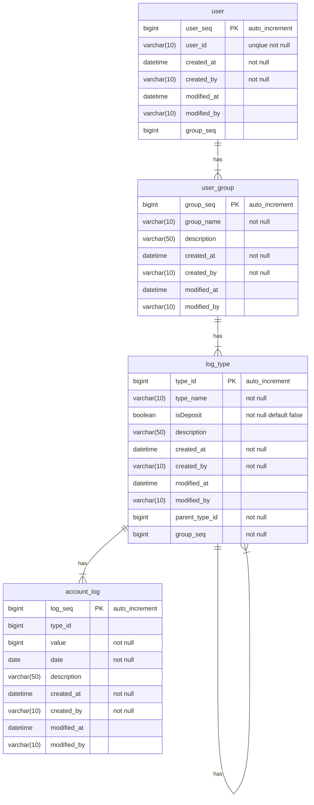

### 개요
가계부 만들기 프로젝트

### 참여 인원
1명

### 기간
2024.08.11 ~

### erd

```mermaid
erDiagram
    user ||--|{ user_group : has
    user_group ||--|{ log_type : has
    log_type ||--|{ log_type : has
    log_type ||--|{ account_log : has
    user {
        bigint user_seq PK "auto_increment"
        varchar(10) user_id "unqiue not null"
        datetime created_at "not null"
        varchar(10) created_by "not null"
        datetime modified_at
        varchar(10) modified_by
        bigint group_seq
    }
    user_group {
        bigint group_seq PK "auto_increment"
        varchar(10) group_name "not null"
        varchar(50) description
        datetime created_at "not null"
        varchar(10) created_by "not null"
        datetime modified_at
        varchar(10) modified_by
    }
    log_type {
        bigint type_id PK "auto_increment"
        varchar(10) type_name "not null"
        boolean isDeposit "not null default false"
        varchar(50) description
        datetime created_at "not null"
        varchar(10) created_by "not null"
        datetime modified_at
        varchar(10) modified_by
        bigint parent_type_id "not null"
        bigint group_seq "not null"
    }
    account_log {
        bigint log_seq PK "auto_increment"
        bigint type_id
        bigint value "not null"
        date date "not null"
        varchar(50) description
        datetime created_at "not null"
        varchar(10) created_by "not null"
        datetime modified_at
        varchar(10) modified_by
    }

```